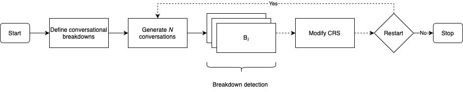

# Conversational Breakdowns Detection

[](https://github.com/psf/black)


This repository contains the data related to the case study presented in the paper "_Identifying Breakdowns in Conversational Recommender Systems using User Simulation_" submitted to the ACM Conversational User Interfaces conference 2024.

The paper proposes a methodology to automatically detect breakdowns in conversational recommender systems using user simulation. It can serve as a diagnostic or development tool. An overview of the methodology is presented in the following figure:



## Data

The simulated dialogues for each iteration of the case study are provided in the `data/simulated_dialogues` directory. We also provide the interaction model used to detect **conversation flow discontinuation** breakdowns in the `data/dialogue_flow.json` file.

Using the data provided, you can run the breakdown detection (see this [section](#run-breakdown-detection)) and retrieve the results presented in the paper.

## Breakdown Detection

The breakdown detection module comprises a set of breakdown detectors and a script to automatically detect breakdowns in dialogues. Below, we describe the types of breakdowns supported:

  * **System failure**: The associated breakdown detector simply verifies that no system errors are thrown during conversation generation between the conversational recommender system and the simulated user. This breakdown can help to identify underlying bugs that were not detected during integration tests. For example, not handling the case when a value is not defined in a slot-value pair during preference elicitation.
  * **Dialogue of the deaf**:  It identifies the agent's utterances and dialogue acts that are identical and consecutive. This breakdown can indicate a pitfall in the dialogue policy from which the conversational agent cannot escape. Indeed, the goal of recommending an item to the user cannot be achieved if the conversational agent keeps repeating the same utterance for multiple turns, i.e., the conversation does not progress. Moreover, such situations can easily frustrate users, who will most likely stop interacting with the agent.
  * **Conversation flow discontinuation**: This breakdown corresponds to an unexpected reply from the conversational agent, more specifically a reply that affects negatively the naturalness of the conversation. For example, it includes delayed reply, i.e., the agent replies to an utterance that was received at least two utterances before, and utterance with a dialogue act that mismatches the dialogue policy.

### Run Breakdown Detection

Make sure to install the required dependencies by running the following command:

```bash
pip install -r requirements.txt
```

Execute the following command to perform breakdown detection on a set of dialogues:

```bash
python -m breakdowns_detection.run_detection <dialogues_path> <dialogue_flow> [--output_file <output_file> --breakdown-components <components> --debug]
```

To save the report in an Excel file, use the `--output_file` argument, otherwise, the report will be printed in the console. For more details about the arguments, run the following command:

```bash
python -m breakdowns_detection.run_detection --help
```
